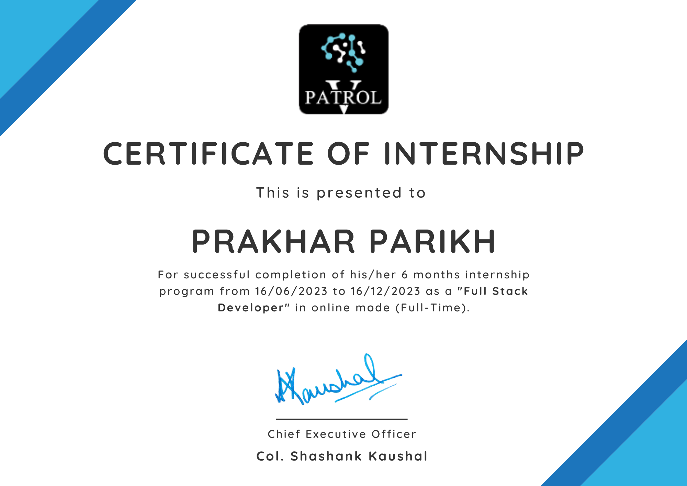
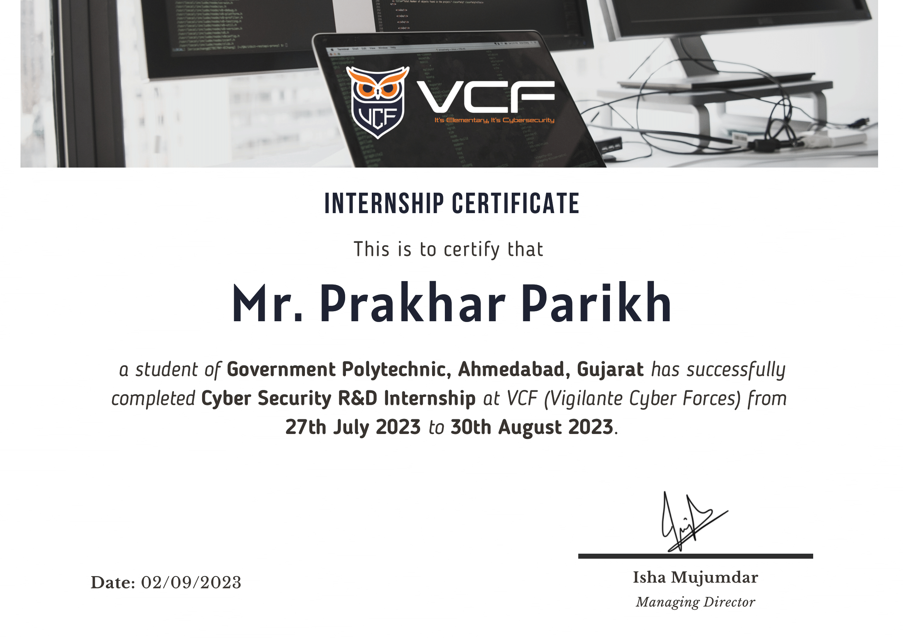
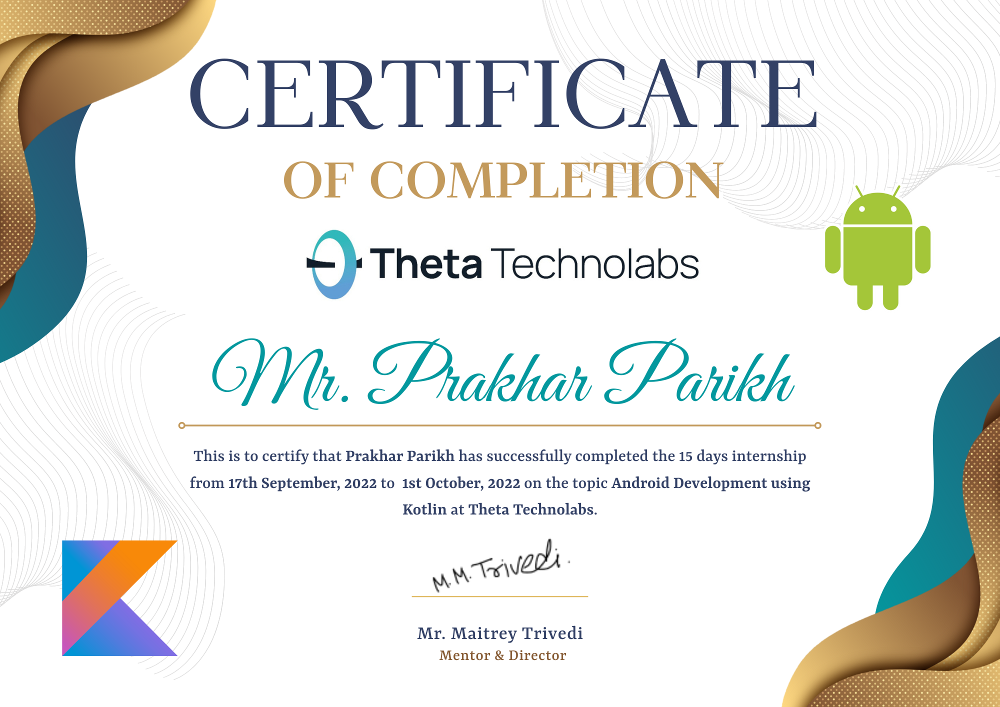

# Professional Experience

This page demonstrates my professional experience such as internships and jobs.

## Full Stack Developer Intern at V-Patrol

  
  <ul>
    <li>Developed Android backdoors using Java and React Native.</li>
    <li>Created a web application for data analysis and visualization using Python Flask and React, incorporating Firebase for real-time data storage.</li>
    <li>Conducted web scraping of meta websites to gather and analyze data for project insights and sentimental analysis.</li>
  </ul>

---

## Cybersecurity R&D Intern at Vigilante Cyber Forces

  
  <ul>
    <li>Developed Python scripts for network scanning to audit and monitor network devices effectively.</li>
    <li>Conducted research on various cybersecurity policies to enhance organizational security frameworks.</li>
    <li>Created prototype Windows applications using PyQt5 and Electron.js, demonstrating cross-platform development capabilities.</li>
  </ul>

---

## Android Development Intern at Theta Technolabs

  
  <ul>
    <li>Assisted in developing basic Android applications using Kotlin.</li>
    <li>Collaborated with team members to design user-friendly interfaces.</li>
    <li>Performed debugging and testing to ensure application functionality.</li>
  </ul>

---
